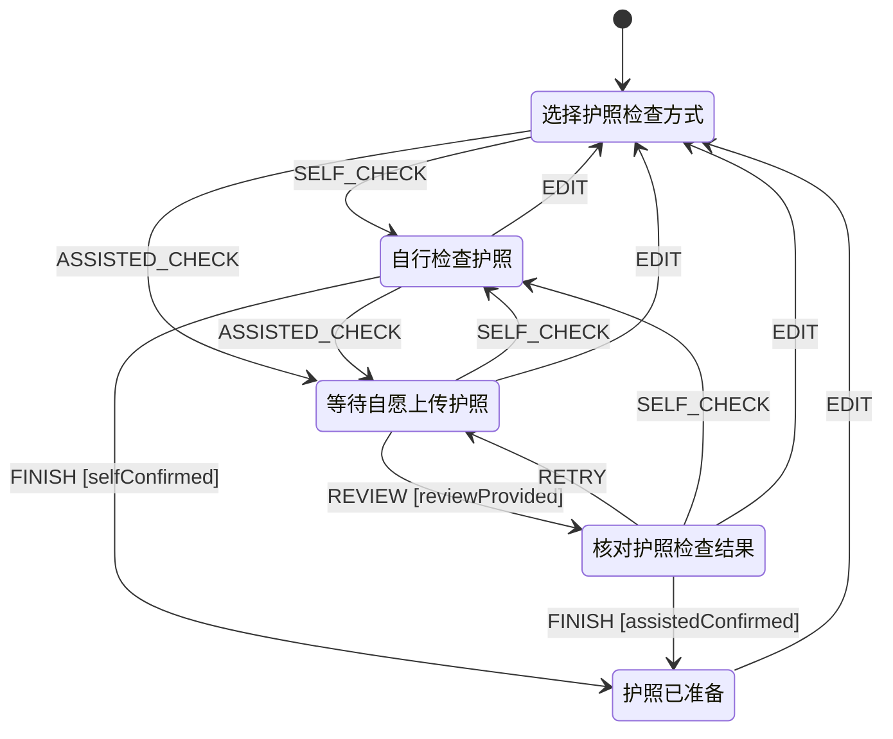

# 护照／旅行证件任务流程

由任务配置生成，不包含申请人数据。

```mermaid
stateDiagram-v2
    [*] --> prepare
    prepare: 选择护照检查方式
    prepare --> self_check: SELF_CHECK
    prepare --> await_upload: ASSISTED_CHECK
    self_check: 自行检查护照
    self_check --> done: FINISH [selfConfirmed]
    self_check --> await_upload: ASSISTED_CHECK
    self_check --> prepare: EDIT
    await_upload: 等待自愿上传护照
    await_upload --> assisted_check: REVIEW [reviewProvided]
    await_upload --> self_check: SELF_CHECK
    await_upload --> prepare: EDIT
    assisted_check: 核对护照检查结果
    assisted_check --> done: FINISH [assistedConfirmed]
    assisted_check --> await_upload: RETRY
    assisted_check --> self_check: SELF_CHECK
    assisted_check --> prepare: EDIT
    done: 护照已准备
    done --> prepare: EDIT
```

完成后仍可 EDIT 返回整理资料；原检查及完成确认同时清除。
