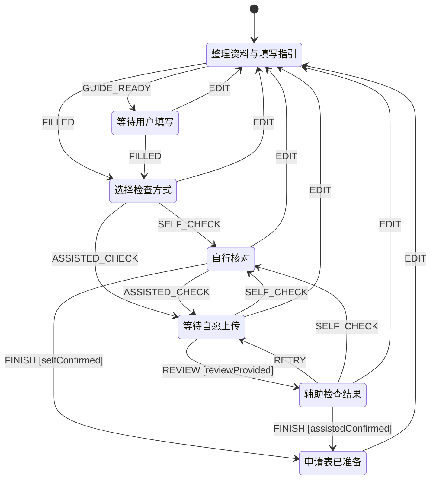

# 申根申请表任务流程

由任务配置生成，不包含申请人数据。

```mermaid
stateDiagram-v2
    [*] --> prepare
    prepare: 整理资料与填写指引
    prepare --> filling: GUIDE_READY
    prepare --> review_choice: FILLED
    filling: 等待用户填写
    filling --> review_choice: FILLED
    filling --> prepare: EDIT
    review_choice: 选择检查方式
    review_choice --> self_check: SELF_CHECK
    review_choice --> await_upload: ASSISTED_CHECK
    review_choice --> prepare: EDIT
    self_check: 自行核对
    self_check --> done: FINISH [selfConfirmed]
    self_check --> await_upload: ASSISTED_CHECK
    self_check --> prepare: EDIT
    await_upload: 等待自愿上传
    await_upload --> assisted_check: REVIEW [reviewProvided]
    await_upload --> self_check: SELF_CHECK
    await_upload --> prepare: EDIT
    assisted_check: 辅助检查结果
    assisted_check --> done: FINISH [assistedConfirmed]
    assisted_check --> await_upload: RETRY
    assisted_check --> self_check: SELF_CHECK
    assisted_check --> prepare: EDIT
    done: 申请表已准备
    done --> prepare: EDIT
```

完成后仍可 EDIT 返回整理资料；原检查及完成确认同时清除。
