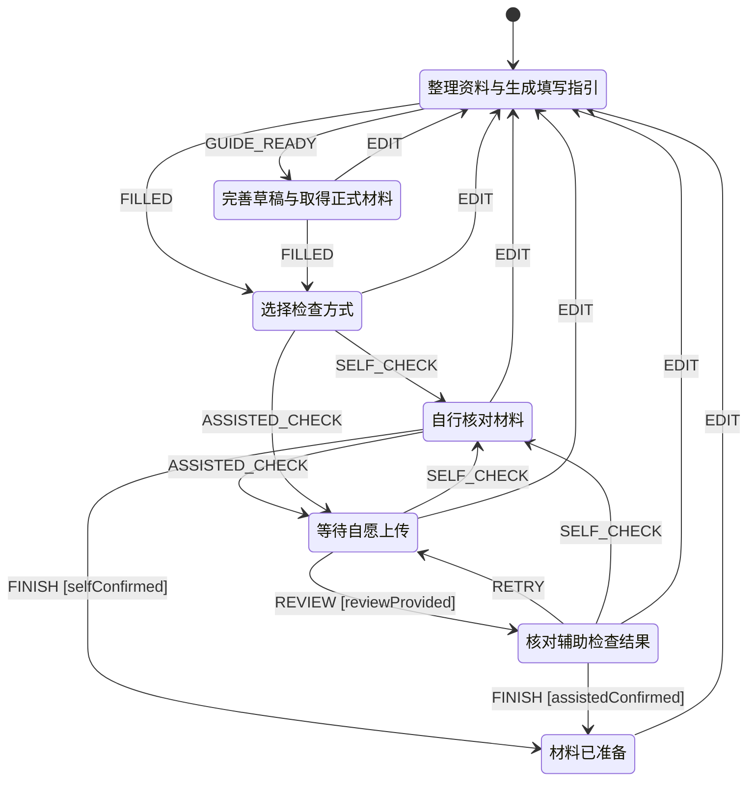

# 逐日旅行行程任务流程

由实际任务配置生成，不包含申请人数据。

任务 ID：`daily_itinerary`；流程：`draft-v1`；版本：`daily_itinerary-v1`。

```mermaid
stateDiagram-v2
    [*] --> prepare
    prepare: 整理资料与生成填写指引
    prepare --> filling: GUIDE_READY
    prepare --> review_choice: FILLED
    self_check: 自行核对材料
    self_check --> done: FINISH [selfConfirmed]
    self_check --> await_upload: ASSISTED_CHECK
    self_check --> prepare: EDIT
    await_upload: 等待自愿上传
    await_upload --> assisted_check: REVIEW [reviewProvided]
    await_upload --> self_check: SELF_CHECK
    await_upload --> prepare: EDIT
    assisted_check: 核对辅助检查结果
    assisted_check --> done: FINISH [assistedConfirmed]
    assisted_check --> await_upload: RETRY
    assisted_check --> self_check: SELF_CHECK
    assisted_check --> prepare: EDIT
    done: 材料已准备
    done --> prepare: EDIT
    filling: 完善草稿与取得正式材料
    filling --> review_choice: FILLED
    filling --> prepare: EDIT
    review_choice: 选择检查方式
    review_choice --> self_check: SELF_CHECK
    review_choice --> await_upload: ASSISTED_CHECK
    review_choice --> prepare: EDIT
```

完成后仍可 EDIT 返回准备步骤；原检查及完成确认同时清除。

## 检查项目

- 逐日覆盖全部行程
- 地点和交通衔接合理
- 与交通和住宿材料一致
- 使用适合递交的语言并核对内容
