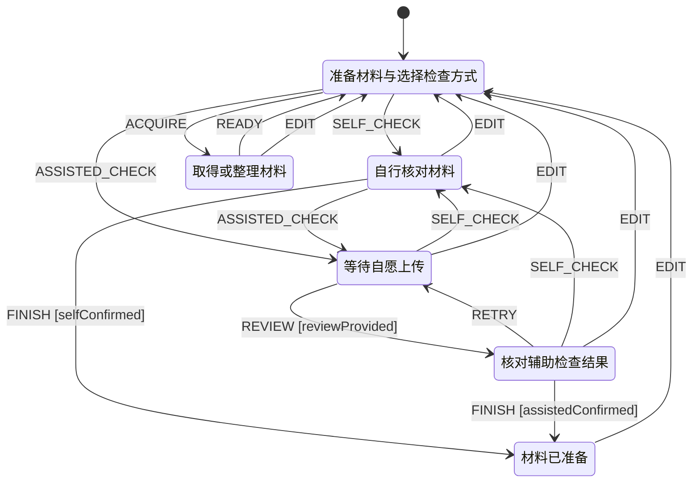

# 雇主营业执照复印件任务流程

由实际任务配置生成，不包含申请人数据。

任务 ID：`employer_license`；流程：`collect-v1`；版本：`employer_license-v1`。

```mermaid
stateDiagram-v2
    [*] --> prepare
    prepare: 准备材料与选择检查方式
    prepare --> self_check: SELF_CHECK
    prepare --> await_upload: ASSISTED_CHECK
    prepare --> acquiring: ACQUIRE
    acquiring: 取得或整理材料
    acquiring --> prepare: READY
    acquiring --> prepare: EDIT
    self_check: 自行核对材料
    self_check --> done: FINISH [selfConfirmed]
    self_check --> await_upload: ASSISTED_CHECK
    self_check --> prepare: EDIT
    await_upload: 等待自愿上传
    await_upload --> assisted_check: REVIEW [reviewProvided]
    await_upload --> self_check: SELF_CHECK
    await_upload --> prepare: EDIT
    assisted_check: 核对辅助检查结果
    assisted_check --> done: FINISH [assistedConfirmed]
    assisted_check --> await_upload: RETRY
    assisted_check --> self_check: SELF_CHECK
    assisted_check --> prepare: EDIT
    done: 材料已准备
    done --> prepare: EDIT
```

完成后仍可 EDIT 返回准备步骤；原检查及完成确认同时清除。

## 检查项目

- 单位与在职证明中的雇主一致
- 所需内容清晰完整
